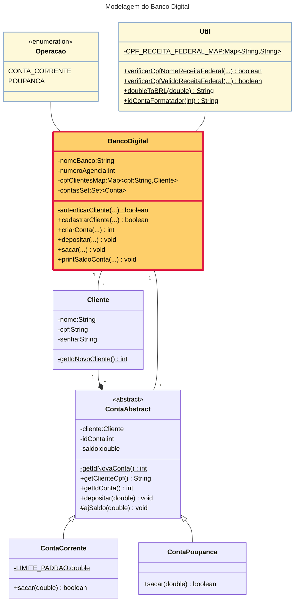

# [DIO](www.dio.me) - Trilha Java Básico

---
## Autor
- [Marco Bezerra](https://github.com/marcobz-bzz)

---
## Desafio — Banco Digital

---
### Premissas
+ O Banco possui uma única agência.
+ As operações são realizadas pelo cliente diretamente na instância da classe BancoDigital.
+ Diferentemente da Poupança, a Conta Corrente possui um **LIMITE** de saque adicional.

---
### Diagrama de Classes

---
### Casos de Uso
O Cliente é o Ator principal, que interage diretamente com o Banco.
1. Criar cadastro para um cliente — utiliza seu **nome**, **cpf**, e [cria] uma **senha**.
   O Banco verifica o nome e cpf na base da Receita Federal, representada por um Map (CPF_RECEITA_FEDERAL_MAP).
   Se tiver sucesso, retorna **true**.
2. Criar conta — utiliza o **cpf** e a **senha** [para autenticar], e o tipo de **Operação**, que pode ser **CONTA_CORRENTE** ou **POUPANCA**.
   Retorna o **id (número) da conta**, sucesso, **id > 0**.
3. Depositar na conta — utiliza um **cpf válido** na base da Receita Federal, o **número (id)** da conta e o montante (**valor**).
4. Imprimir o saldo de uma conta — utiliza o **cpf** e a **senha** [para autenticar], e o **número (id)** da conta.
5. Sacar um valor da conta — utiliza o **cpf** e a **senha** [para autenticar], e o **número (id)** da conta.
   A Conta Corrente permite utilizr o **LIMITE** banćario.
6. Transferir de uma conta para outra — utiliza o **cpf** e a **senha** [para autenticar], e o **número (id)** da conta de origem, o **número (id)** da conta de destino e o **valor**.
7. Gerar extrato do cliente — utiliza o **cpf** e a **senha** [para autenticar].

---
### Implmentação em Java
Usando VScode, em:

https://github.com/marcobz-bzz/dio-trilha-java-basico/tree/main/desafios/BancoDigital

---
+ + +