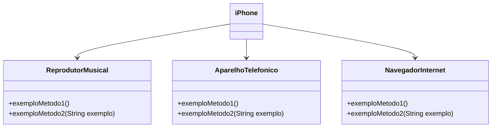

# [DIO](www.dio.me) - Trilha Java Básico

## Autor
- [Marco Bezerra](https://github.com/marcobz-bzz)

## POO - Desafio

### Modelagem e Diagramação de um Componente iPhone

## Diagrama de Classes

### Exemplo de Diagrama UML (Mermaid)

### Exemplo de Diagrama UML (Mermaid)

