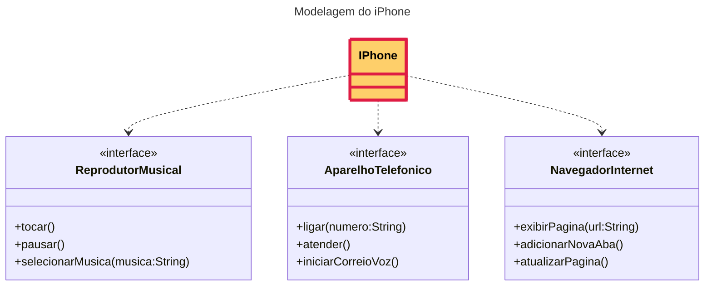

# [DIO](www.dio.me) - Trilha Java Básico

---
## Autor
- [Marco Bezerra](https://github.com/marcobz-bzz)

---
## POO - Desafio

---
### Modelagem e Diagramação de um Componente iPhone
[Projeto iPhone](https://github.com/marcobz-bzz/dio-trilha-java-basico/tree/main/desafios/poo)

---
## Diagrama de Classes

---
## Implmentação em Java
Usando VScode, em:

https://github.com/marcobz-bzz/dio-trilha-java-basico/tree/main/desafios/poo/IPhone/src/br/edu/dio/iphone/model

---
+ + +
